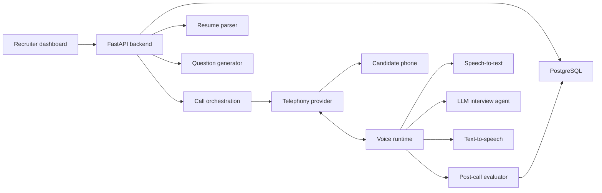
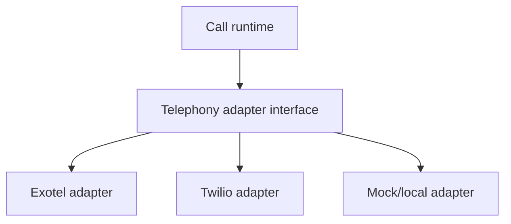
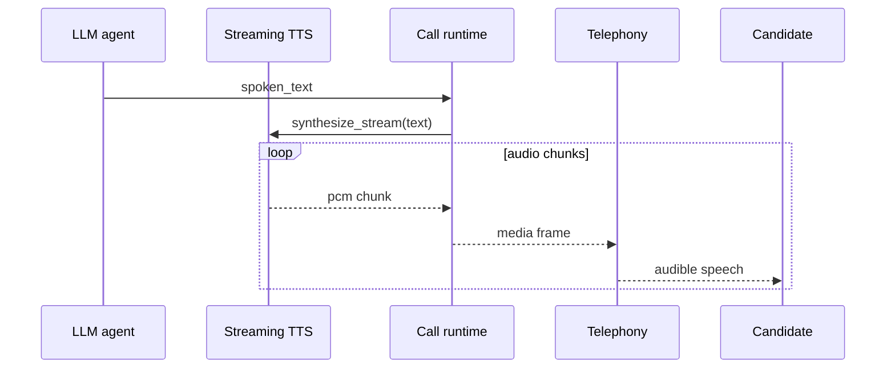
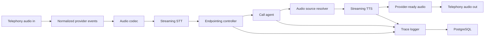
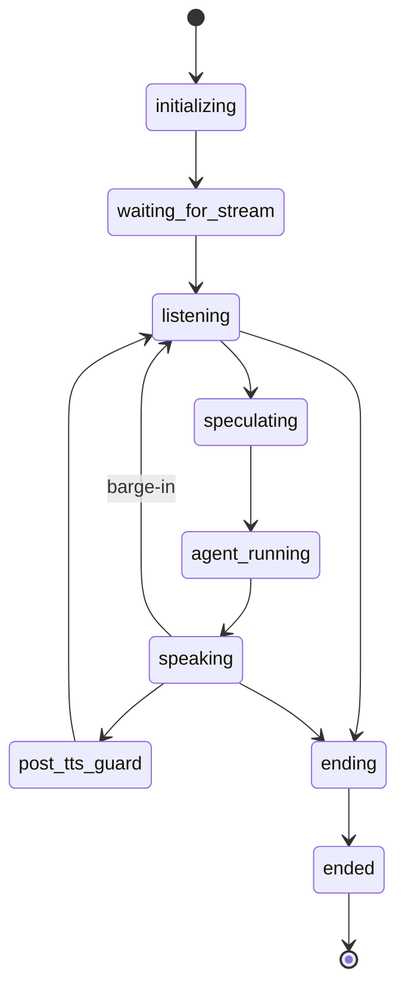
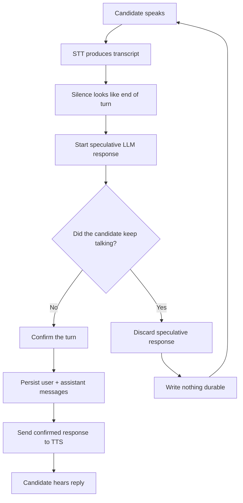

export const meta = {
  slug: 'building-recruiteai-voice-agent',
  title: 'Building RecruiteAI: the voice agent that learned to interview.',
  description: 'A technical journey through the product, architecture, latency work, telephony quirks, and service choices behind RecruiteAI.',
  dek: 'What started as a recruiting product became a real-time voice systems project: telephony, speech recognition, endpointing, TTS, evaluation, and the long road from impressive demo to useful tool.',
  category: 'AI Engineering',
  publishedAt: '2026-05-29',
  readTime: '20 min',
  featured: false,
  draft: true,
  tags: ['voice agents', 'RecruiteAI', 'telephony', 'FastAPI', 'Deepgram', 'Sarvam', 'Exotel', 'architecture'],
  toc: [
    { id: 'what-i-wanted-to-build', label: 'What I wanted to build' },
    { id: 'what-recruiteai-does', label: 'What RecruiteAI does' },
    { id: 'the-first-architecture', label: 'The first architecture' },
    { id: 'the-build-timeline', label: 'The build timeline' },
    { id: 'why-these-services', label: 'Why these services' },
    { id: 'phone-calls-are-not-chat', label: 'Phone calls are not chat' },
    { id: 'the-latency-work', label: 'The latency work' },
    { id: 'why-i-rebuilt-the-call-runtime', label: 'Why I rebuilt the call runtime' },
    { id: 'the-v2-architecture', label: 'The v2 architecture' },
    { id: 'speculative-endpointing', label: 'Speculative endpointing' },
    { id: 'what-i-learned-from-the-product-layer', label: 'Product lessons' },
    { id: 'what-i-would-do-again', label: 'What I would do again' },
  ],
};

I did not set out to build a voice infrastructure company.

I wanted to build a recruiting product.

The original idea behind RecruiteAI was practical: recruiters spend too much time on first-round phone screens, and a lot of that time is repetitive. They need to confirm availability, communication, basic experience, project depth, salary expectations, notice period, and whether the resume is real enough to justify a longer interview. That work matters, but it is also exactly the kind of structured, high-volume conversation that an AI system should be able to assist with.

So the product brief was simple: upload resumes, generate questions, call candidates, interview them, and give the recruiter a useful evaluation.

The engineering brief was less simple: make an AI agent sound natural enough on a real phone call, handle Indian phone numbers reliably, survive noisy audio, keep latency low, avoid interrupting candidates, produce structured evidence, and explain every score well enough that a recruiter can trust it.

This is the story of building that system.

<h2 id="what-i-wanted-to-build">What I wanted to build</h2>

RecruiteAI is an automated telephone interview platform. A recruiter creates a job, uploads resumes, lets the system parse and rank candidates, generates interview questions, and starts an AI phone screen from the dashboard.

The call is not meant to replace the entire hiring process. It is meant to replace the repetitive first pass. A good phone screen answers a narrower question:

> Is this person worth the next human interview?

That framing changed the product. It meant the agent did not need to behave like a senior interviewer. It needed to be reliable, polite, structured, and good at surfacing signal.

The most important output was not the call itself. It was the report after the call: scores, strengths, weaknesses, communication notes, behavioral observations, transcript evidence, cost, latency, and the recording. The recruiter should be able to understand what happened without replaying a 20-minute conversation.

<h2 id="what-recruiteai-does">What RecruiteAI does</h2>

The product grew into a full workflow:

- Recruiters create and manage jobs.
- Candidates are uploaded in bulk as resumes.
- Resumes are parsed into structured candidate profiles.
- Candidates are matched against job descriptions.
- Interview questions are generated per job.
- Calls can be placed through real telephony providers or a local simulator.
- The AI agent conducts a consent-first interview.
- Calls are recorded and transcribed.
- A post-call evaluator scores the candidate.
- Recruiters review the report, transcript, recording, and metrics.

The stack is intentionally boring around the product and more experimental only where the voice problem requires it:

- React, Vite, Tailwind, and shadcn/ui on the frontend.
- FastAPI, SQLAlchemy, PostgreSQL, and Alembic on the backend.
- OpenAI and LangChain for language tasks.
- Deepgram for speech-to-text.
- Sarvam and Deepgram for text-to-speech.
- Exotel, Twilio, and a mock provider for telephony.
- LangSmith and custom metrics for tracing, latency, and cost.

The product layer is CRUD-heavy. Jobs, resumes, questions, calls, recordings, evaluations, and analytics all benefit from conventional database-backed application design. The voice layer is different. It is a real-time system pretending to be a normal web feature.

That difference drove most of the hard lessons.

<h2 id="the-first-architecture">The first architecture</h2>

The first version was built like a straightforward AI application with a voice pipe attached.



This architecture got the product moving quickly. It also gave me clean seams:

- Resume processing could run independently of calls.
- Question generation could be retried or edited manually.
- Telephony providers could sit behind one interface.
- Evaluation could happen after the call instead of during the call.
- Local development could use a mock provider without placing real calls.

The first version supported an OpenAI Realtime runtime and a pipeline runtime. The pipeline runtime looked like this:

```text
candidate audio
-> telephony websocket
-> speech-to-text
-> LLM reasoning
-> text-to-speech
-> telephony websocket
-> candidate audio
```

It sounds clean on paper. In production, each arrow hides timing, buffering, encoding, cancellation, retries, and provider-specific behavior.

<h2 id="the-build-timeline">The build timeline</h2>

Looking back through the git history, the project did not progress in a neat line. It moved in waves.

The first wave was product foundation: authentication, job management, resume parsing, question generation, call initiation, evaluation, and live call progress. This was the part that made RecruiteAI feel like software a recruiter could actually use.

The second wave was trust: better dashboards, call detail views, cost observability, latency markers, recording playback, and structured post-call scoring. The product had to explain itself.

The third wave was telephony reality: Exotel media streaming, webhook stabilization, provider fallback paths, call endings, recordings, and local simulators. This was where "place a call" turned into "survive every state a phone network can throw at you."

The fourth wave was voice quality and latency: Deepgram model changes, Indian English tuning, Sarvam TTS, streaming audio, pre-generated prompt audio, barge-in handling, and short-answer termination fixes.

The fifth wave was the runtime rebuild: `call_v2`, speculative endpointing, generation IDs, non-blocking agent execution, configurable silence behavior, browser simulation, and detailed trace summaries.

That order matters. I could not have designed the v2 runtime correctly on day one. I needed the messy first version to teach me where the real boundaries were.

<h2 id="why-these-services">Why these services</h2>

I chose services based on the shape of the problem, not only on benchmark numbers.

<h3>FastAPI and PostgreSQL</h3>

FastAPI fit the backend because the system is IO-heavy: uploads, background processing, WebSockets, SSE progress events, telephony callbacks, and calls into AI providers. Python also made the AI integrations easier to move quickly.

PostgreSQL was the obvious database. The product has relational data everywhere: jobs, candidates, resumes, questions, calls, messages, evaluations, recordings, costs, and trace summaries. I did not want the database to be an experiment.

<h3>React, Vite, Tailwind, and shadcn/ui</h3>

The frontend needed to be fast to build and easy to iterate. Most screens are operational: tables, filters, job details, candidate modals, upload progress, call history, audio playback, and evaluation reports. shadcn/ui gave me a clean base without forcing the app into a heavy design system too early.

<h3>Deepgram for STT</h3>

Speech recognition is the foundation of the call. If the transcript is wrong, the agent reasons on bad input, the evaluator scores bad evidence, and the recruiter loses trust.

Deepgram gave me streaming transcription, interim results, endpointing controls, and phone-call models. I later moved to Nova-3 with `en-IN` and keyterm prompting in parts of the system because names, skills, and Indian English mattered.

<h3>Exotel for India, Twilio for general telephony, mock for development</h3>

Twilio is excellent for many telephony workflows, but Indian phone numbers pushed me toward Exotel. I wanted the architecture to avoid a single-provider trap, so telephony became an adapter:



That adapter layer paid for itself. Exotel and Twilio do similar things at a product level, but the WebSocket events, path behavior, audio formats, call status callbacks, and recordings are different enough that they should not leak into the agent.

<h3>Sarvam for Indian-accented TTS</h3>

Voice quality is not only about clarity. For a recruitment call in India, accent and familiarity matter. Sarvam was attractive because the voice sounded more locally appropriate.

That choice introduced one of the biggest engineering problems in the project: latency. The better-sounding voice was not useful if every turn paused long enough to make the candidate wonder if the call had broken.

<h3>LangSmith and custom metrics</h3>

Voice systems are hard to debug from normal logs. You need to know when the call was answered, when the stream connected, when first audio arrived, when the candidate started speaking, when STT emitted text, when the agent ran, when TTS started, and when audio actually reached the provider.

So RecruiteAI tracks cost and latency per call, not just errors. That changed the debugging loop from "the call felt slow" to "this turn spent 3.2 seconds waiting for TTS."

<h2 id="phone-calls-are-not-chat">Phone calls are not chat</h2>

The first working demo felt magical. The agent called, asked questions, listened, and responded.

Then real calls exposed the difference between chat and voice.

In chat, the user presses send. In a phone call, the system has to infer when the user is done. People pause mid-sentence. They say "umm." They correct themselves. They answer with one word. They talk over the assistant. They sit silently because they are thinking. They ask "hello?" when the system is slow.

That created several problems.

<h3>Consent and call control</h3>

The agent had to start with consent: "Hi, is now a good time?" If the candidate declined, the system needed to end politely. If the candidate agreed, it could continue. If the candidate was confused, it had to clarify.

Early prompts were too willing to over-explain or ask for consent repeatedly. I had to tighten the agent instructions so consent happened once, the opener stayed short, and the call moved forward.

<h3>Provider quirks</h3>

Exotel forced several practical lessons:

- Accept the WebSocket quickly or the provider can close the connection.
- Resolve the resume or call context through multiple paths because provider callback payloads are not always shaped the way you want.
- Keep codec conversion explicit.
- Do not assume continuous audio frames mean the candidate is actively speaking.
- Fetch recordings with retries because they may not be available at the exact moment the call status callback arrives.

None of these are glamorous. All of them decide whether the product feels real.

<h3>Speech recognition and endpointing</h3>

The agent cannot respond every time it sees a partial transcript. It needs a turn. But waiting too long makes the call sluggish.

The initial approach relied too much on provider endpointing and hand-tuned silence rules. It worked, but it was fragile. Short answers were sometimes treated as incomplete. Longer answers were sometimes cut too early. Assistant speech could trigger false interruption logic.

Every bug sounded like a personality flaw. A timing issue becomes "the agent is rude." A transcript issue becomes "the agent is dumb." A TTS delay becomes "the agent is confused."

That is the strange thing about voice agents: systems bugs are perceived as social behavior.

<h2 id="the-latency-work">The latency work</h2>

The biggest latency fight was TTS.

Sarvam gave me a voice I liked, but the first implementation waited too long before the candidate heard anything. In one analysis, average generation time was around 3.27 seconds, delivery delay was around 6.52 seconds, and total time approached 9.8 seconds. That is not a pause. That is a broken conversation.

The first fix was to stop treating TTS as a single blob. Instead of waiting for a full audio file, the runtime needed to stream chunks as they arrived.



That changed the perceived latency. In a successful test call, the time to first assistant audio was about 0.453 seconds. Compared with the earlier 3.2 second wait for first usable audio, that was a different product.

But the story was not simply "streaming fixed it." Later call analysis showed uneven provider behavior: some turns were fast, while others still had multi-second delays before the first chunk arrived. Streaming solved buffering under my control. It did not eliminate upstream TTS variability.

That distinction matters. When you debug latency, you need to separate:

- time spent before the request leaves your system;
- time spent waiting for the provider's first byte;
- time spent buffering chunks;
- time spent transcoding audio;
- time spent sending frames to telephony;
- time perceived by the candidate.

Without those markers, optimization becomes guesswork.

<div className="prose-callout">
  <p>The lesson was not "always use streaming." The lesson was: measure first audible output, not just API completion time. Users do not experience your backend span. They experience silence.</p>
</div>

<h2 id="why-i-rebuilt-the-call-runtime">Why I rebuilt the call runtime</h2>

By the time the product worked end-to-end, the call layer had accumulated too much patch-on-patch logic. That is normal in a fast AI prototype. You learn the problem by building the wrong abstraction first.

The rebuild became `call_v2`.

The goal was to make the calling system general-purpose and easier to reason about. Recruiting would be the first use case, but the runtime itself should not be full of recruiting-specific assumptions.

The key boundary was this:

> The agent decides what to say. The runtime decides what is safe to speak, when to speak it, how to cancel it, and what becomes durable history.

That boundary clarified the system.

The agent owns conversation policy: question order, follow-ups, clarification, redirection, and ending the call.

The runtime owns mechanics: provider events, audio formats, state transitions, cancellation, endpointing, TTS, persistence, trace logging, and safety rules.

<h2 id="the-v2-architecture">The v2 architecture</h2>

The v2 pipeline looks like this:



The important components are:

- `CallSession`: owns one live call lifecycle.
- `TelephonyAdapter`: hides provider-specific WebSocket formats.
- `AudioCodec`: keeps encoding and sample-rate conversion explicit.
- `STTEngine`: streams audio and emits transcript events.
- `EndpointingController`: decides tentative and confirmed turns.
- `CallAgent`: returns structured spoken text and actions.
- `AudioSourceResolver`: decides whether audio comes from cache, filler, or live TTS.
- `TTSEngine`: streams speech and supports cancellation.
- `Persistence`: writes only durable call data.
- `TraceLogger`: records the runtime story for debugging.

The state machine made the runtime easier to inspect:



This looks like ceremony until you need to debug a bad call. Then it becomes essential. A trace can show whether the assistant was speaking, whether candidate audio arrived during the guard window, whether a speculative response was reused, whether a stale generation was cancelled, and whether the message was actually persisted.

<h2 id="speculative-endpointing">Speculative endpointing</h2>

Speculation was the most interesting part of the v2 runtime.

The basic latency problem is that the system cannot know the candidate is done speaking until it waits. But if it waits and only then starts the LLM, the call feels slow.

The compromise is speculative endpointing:



The rules are strict:

- Speculative work can read context.
- Speculative work cannot write durable state.
- Speculative work cannot execute tools.
- Speculative work cannot start TTS.
- Speculative work cannot end the call.
- Only the latest confirmed generation can speak.

That let the system hide part of the LLM latency inside the silence window without letting a guess become reality. If the candidate kept talking, the speculative result was thrown away. If the silence held, the response could be reused.

This was the point where RecruiteAI stopped feeling like a normal LLM app. The hard part was not generating language. The hard part was deciding when generated language was allowed to become sound.

<h2 id="what-i-learned-from-the-product-layer">What I learned from the product layer</h2>

The voice runtime got the most engineering attention, but the product only works if the recruiter experience is calm.

Resume upload needed progress events because parsing several files through AI feels broken without feedback. The app uses SSE so the recruiter can see a session move through upload, parsing, matching, and completion.

Question generation needed manual override because AI-generated questions are good starting points, not sacred artifacts. Recruiters need to edit, delete, reorder, and regenerate questions.

Evaluation needed structure. A generic paragraph is not enough. The output needs scores, dimensions, recommendation, strengths, weaknesses, and evidence.

Call history needed operational details: provider, runtime, status, recording, duration, cost, and latency. When a recruiter asks why a call went poorly, the system should show more than "failed."

The product lesson was simple: AI impresses people in the demo, but workflow earns the repeat usage.

<h2 id="what-i-would-do-again">What I would do again</h2>

I would keep the provider abstraction from day one. Telephony, STT, TTS, storage, and runtime selection all changed during the project. Interfaces kept those changes survivable.

I would keep the mock provider. Local development for voice systems is painful if every test places a real phone call. The browser simulator and mock runtime made it possible to debug state, transcripts, and endpointing without waiting on the phone network.

I would keep the latency instrumentation. Every serious optimization came from markers, not vibes.

I would keep post-call evaluation separate from the live agent. The live agent should focus on conversation. The evaluator can be slower, more structured, and more evidence-driven.

I would also rebuild the runtime earlier. The first version helped me learn, but the v2 boundaries are the architecture I would want in production:

- provider quirks stay in adapters;
- codec conversion stays explicit;
- endpointing is a first-class controller;
- speculative work has safety boundaries;
- durable history only contains confirmed turns;
- traces are required artifacts, not optional logs.

The biggest thing I would do differently is treat latency as a product feature earlier. In a web app, a 2-second delay is annoying. In a phone call, a 2-second delay changes the user's interpretation of the agent. Silence has meaning.

RecruiteAI began as a recruiting automation project. It became a lesson in real-time systems, human expectations, and the uncomfortable truth that a voice agent is judged less like software and more like a person on the other end of the line.

That is what made it hard.

That is also what made it worth building.
